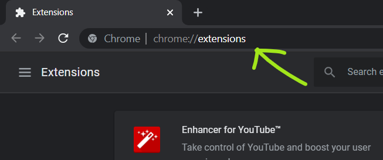

# Google Meet Notify : Chrome Extension

A chrome extension that will listen to given keywords in google meet, chat and sends a notification when a keyword is detected in the google meet chat.

I used to put the google meet tab on mute and at the end of each class, I used to miss roll call but with Meet Notify lose no more attendance.

## Install Locally

- [Download](https://github.com/uttusharma/meet_notify/releases/tag/Release) or Clone this repo
- Navigate to **chrome://extensions**
  

- Expand the Developer dropdown menu and click **“Load Unpacked Extension”**

- Navigate to the local folder containing the extension’s code and click **Ok**

Assuming there are no errors, the extension should load into your browser

